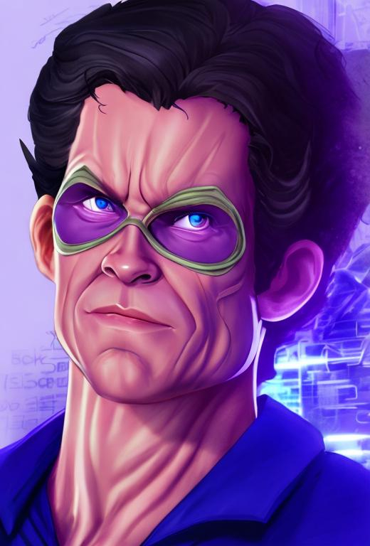
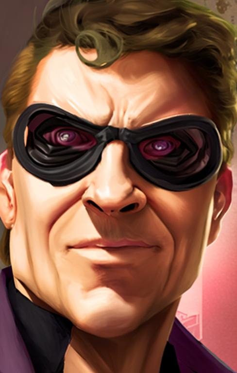

# Sindria :crown:

## Table of Contents

- [📜 About the challenge](#about-the-challenge)
  - [Sindria Staff Engineer Coding Challenge](#sindria-staff-engineer-coding-challenge)
  - [Evaluation](#evaluation)
  - [Opportunity](#opportunity)

## 🏆 Sindria `Staff Engineer` Coding Challenge

[🎯 Sindria staff engineer coding challenge](https://handsomely-relation-dc4.notion.site/Sindria-staff-engineer-coding-challenge-ad6f83387e5e4be39eda3a87cf9bd7b6)

- [ ] Build a **REST API** to access the ENEM question database.
- [ ] Implement **gamification** in the form of a **quick quiz**, where users can answer **ENEM** questions and earn points based on their correct answers.

### 🔍 Evaluation

- [ ] **Code Quality**: Structure, readability, and best practices.
- [ ] **Functionality**: Does the API work as expected? Is the gamification logic correctly implemented?
- [ ] **API Design**: How are the endpoints structured? Is the API intuitive?

### ⭐ Opportunity

> :loudspeaker: **Note:** I have been using my GitHub repositories to consolidate my knowledge and methods, as well as to conduct and validate my personal research on [Personal Knowledge Management](https://www.youtube.com/watch?v=nJ660t5ku9A&t=220s), [Skills Tree](https://www.youtube.com/watch?v=wsmEuHa1eL8), [Gamification](https://www.gamificationbook.com/), and to further develop my thesis at [FIAP](https://www.fiap.com.br/graduacao/bacharelado/sistemas-de-informacao/).
>
> :handshake: My interviewer, **José Baptista**, _gave me the freedom_ to suggest the scope, so...
>
> 
>
> ```
> ██╗████████╗███████╗    ████████╗██╗███╗   ███╗███████╗██╗
> ██║╚══██╔══╝██╔════╝    ╚══██╔══╝██║████╗ ████║██╔════╝██║
> ██║   ██║   ███████╗       ██║   ██║██╔████╔██║█████╗  ██║
> ██║   ██║   ╚════██║       ██║   ██║██║╚██╔╝██║██╔══╝  ╚═╝
> ██║   ██║   ███████║       ██║   ██║██║ ╚═╝ ██║███████╗██╗
> ╚═╝   ╚═╝   ╚══════╝       ╚═╝   ╚═╝╚═╝     ╚═╝╚══════╝╚═╝
> ```

## 🚀 The Hero Engineer's Journey

<div align="center">
  

   

</div>

<table align="center" style="border-collapse: collapse; background-color: transparent;">
  <tr>
    <td align="center">
      <div>
        
        <br>
        <a href="https://img.shields.io/badge/The%20Bashman%20Vinna-red">
          
        </a>
      </div>
    </td>
    <td align="center">
      
      <br>
      <a href="https://img.shields.io/badge/The%20Riddler%20Jose-black">
        
      </a>
    </td>
  </tr>
</table>
